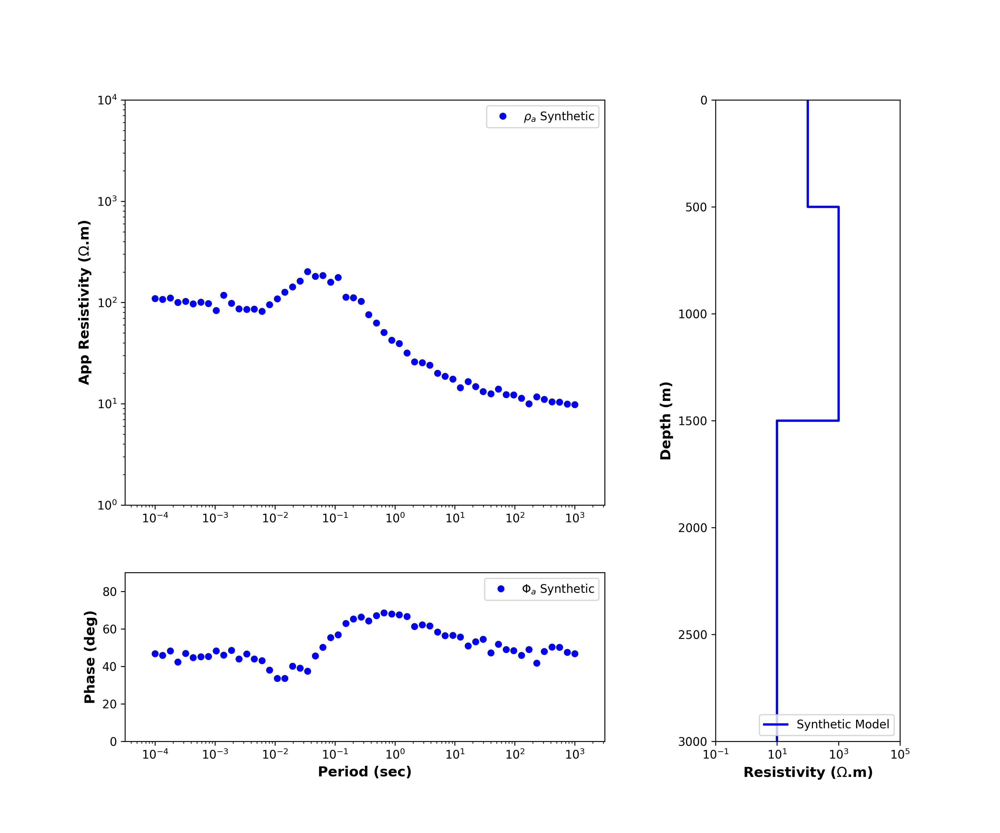

# Forward_MT1D
1D Magnetotelluric Forward Modelling (Python)

Reference: https://www.digitalearthlab.com/tutorial/tutorial-1d-mt-forward/

Sampel:
3 layer resistivity model (K-type)

Rho 1 : 100 Ohm.m   ||  Thickness 1 : 500 m

Rho 2 : 1000 Ohm.m  ||  Thickness 1 : 1000 m

Rho 3 : 10 Ohm.m    ||  Thickness 3 : Inf

Periods range : 10^-3 to 10^4 sec

